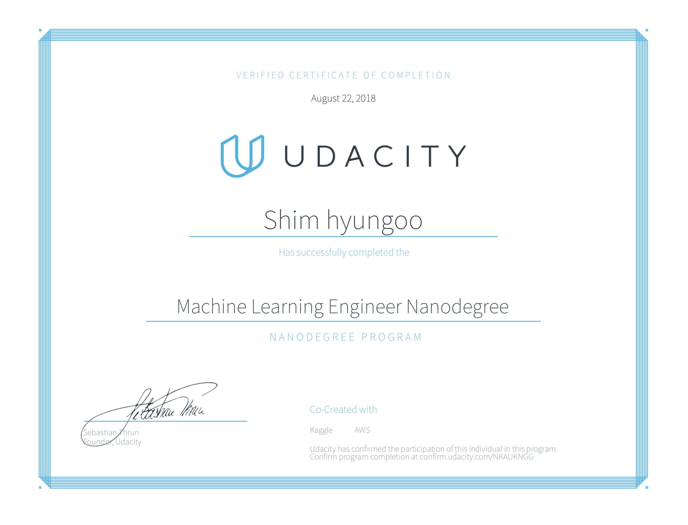

# Machine_Learning_Engineer_Nanodegree

## In this program you will master Supervised, Unsupervised, Reinforcement, and Deep Learning fundamentals. You will also complete a capstone project in your chosen domain.

 

## Contents  

### Project Overview

The following rated projects were part of this nanodegree:
